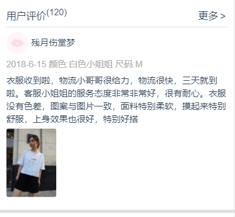
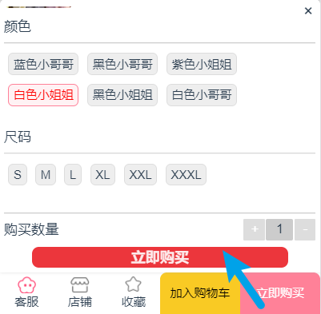

# supermall项目文档

---

## 项目介绍

* 该项目是一个基于node环境开发的前后端分离的商城应用
* 应用的技术
  * web基础
  * vue2.0、vue-cli3、vue-router、vuex、axios
  * webpack
* 项目中依赖的外部文件、包
  * normalize.css
  * better-scroll
  * fastclick
  * vue-lazyload
  * postcss-px-to-viewport
* 开发工具
  * VSCode


## 开发过程

### 一、创建项目

​	该项目使用vue-cli3进行重构，首先使用vue-cli3进行项目的配置。`vue create supermall`，只选择配置vue版本以及bable，其余工具后期安装，练习阶段，不使用默认创建好的一些使用工具的目录（vue-router、vuex）。

#### 1.1 .editorconfig 文件

​	该文件是用来配置`代码风格`的，vue-cli2创建的vue项目会自动创建.editorconfig文件，但是vue-cli3创建的vue项目需要手动创建.editorconfig文件。

​	代码风格在实际开发中是很重要的，关乎到团队开发的效率，团队协作开发时，相同的代码风格会提高阅读效率，并且代码更加美观统一。

​	

```js
root = true						// 控制 .editorconfig 是否生效的字段
	
[*]								// 匹配全部文件
charset = utf-8					// 字符集
indent_style = space			// 缩进风格
indent_size = 2					// 缩进尺寸
end_of_line = lf				// 结尾换行符，可选"lf"、"cr"、"crlf"
insert_final_newline = true		// 文件结尾插入新的一行
trim_trailing_whitespace = true	// 删除一行中的前后空格
```


#### 1.2 vue.config.js 文件

​	vue.config.js是用来配置webpack的，由于vue-cli3将webpack的配置隐藏了起来，很不容易寻找，所以通过创建该文件来对webpack进行配置，会自动将vue.config.js中的配置自动合并到webpack中。

```js
//commonJS规范，将配置暴露
module.exports={
    configureWebpack:{
        //具体的配置
        resolve:{alias:{……}}
    }
}
```


### 二、项目目录的组织

* components（自带）
  * common	（公共组件）
  * content     （嵌入项目的组件）
* assets （项目资源目录【自带】）
  * css
  * images

* router （配置路由）
* store  （状态管理）
* network（网络请求相关）
* views   （视图组件）
* common （存放公共文件、工具、常量等）


### 三、TabBarCPN

​	由于每个项目都可能使用到TabBar组件，所以TabBar组件的封装，放置在公共组件目录中components->common

​	但是这些公共组件要内嵌于项目中，做具体的配置。所以需要一个组件TabBarMain，用来在项目中使用封装好的TabBar组件。这个组件放在 嵌入项目的组件目录content中（components->content）

##### 组件之间的关系

​	components->common->【TabBar、TabBarItems】

​	components->content->【TabBarMain】

>**TabBar**
>
>​	封装整个组件，里面提供一个插槽，供给外部文件使用（TabBarMain）。
>
>**TabBarItems**
>
>​	为了保证组件的灵活性，单独把TabBar中的每一个选项独立封装成一个组件，供外部插拔使用，TabBarItems包含三个插槽【Active_image、image、txt】
>
>**TabBarMain**
>
>​	该组件嵌入项目中，做具体的配置，依赖于TabBar、TabBarItems两个组件。在TabBarMain中复用前面的两个组件、并配置两个组件的插槽

#### 重点

##### 设置活跃样式

* 要设置活跃样式，就要判断`当前的path[是否包含]当前组件映射的路由path`。
* 处理函数必须能够实时监听路由path的改变。

使用computed，并让对应的计算属性直接绑定在v-if上，来决定是否展示活跃图片。然后再增加一个computed_method，用于处理活跃状态的文字样式。给对应标签使用v-bind绑定style属性。

```js
computed: {
    isActive() {
      return this.$route.path.includes(this.path);
    },
    setActiveStyle() {
      return this.isActive
        ? { color: this.activeStyle }
        : { color: this.defaultStyle };
    }
}
```


### 四、主页开发

​	主页包含6部分：navbar、swiper、recommend、feature、tabControl、goodsList

​	应用到的其它组件：Scroll、backTop

#### 4.1 navbar

  navbar是各个项目中常见的组件，所以将其封装于conponents->common->navbar->navbar.vue中。

  将该组件划分为三部分: left、center、right, 并分别为对应部分设置插槽，内容由外部(使用该组件的文件)进行填充。

---

#### 4.2 swiper

  swiper轮播组件，可以结合.vue文件进行封装，也可以使用原生js进行封装（该项目使用原生封装）。

  swiper类接收的参数：preset

```js
let preset = {
  wrapper ,			//maxBox
  content ,			//contentBox
  iconsBox ,		//iconsBox
  iconsClass ,		//iconsClass 用于内部设置class名，不需要加"."
  icons_A_Class ,	//处于活跃状态的icon 用于内部设置class名，不需要加"."
  ImageLinks ,		//imageBox
  images,			//img
  transitionT,		//过渡时间
  interval,			//间隔时间
  percent			//滑动百分比
};
```

  组件需要提供的html：wrapper、content、iconsBox。

  外部只需要提供image、并在接收到图片后创建imageBox、img并设置基本的宽高。就可自动生成轮播组件，并在iconsBox中创建对应个数的icon。

  为了保证组件style的灵活，组件内部并没有初始化样式。需要根据用户提供的preset中的类名设置对应的样式。

---

#### 4.3 recommend

  

​	请求对应的接口，拿到数据，进行展示，该组件有唯一性，所以放在views->home->HomeRecommend.vue中。

#### 4.4 feature


​	该组件其实就是一张图片，link到对应的url即可。该组件具有唯一性，也放置在views->home目录下

#### 4.5 tabControl


​	该组件，可能会出现在**本项目中的**各个界面，我选择将他封装为**内容组件**components->**content**->tabcontrol->TabControl.vue

​	该组件完成的功能：点击，改变CurrentIndex，$emit告知父组件，赋予activeStyle。

​	为了保证样式的灵活性，活跃样式类名由外部（父组件TabControlMain）传入，然后在父组件中直接通过css设置activeStyle即可。

​	例如在Detail页面中，就使用到了TabControl（嵌套在了NavBar的center中），并且赋予了不同于主页面的样式。


---

#### 4.6 goodsList


​	该组件用于商品列表的展示，在每个项目中都可能用到，所以将其封装为公共组件components->common->goods->(goodsList.vue、goodsItems.vue)

​	goodsList组件用于接收需要展示的商品列表数据Arr，然后每个商品单独抽离为一个goodsItems，再遍历展示即可。

##### 关于事件总线$bus

​	为了让better-scroll获取到正确的高度，需要监听goodsItems中图片的load事件，并告知home的子组件scroll组件进行refresh。但是由于从home到goodsItems，总共有三个层级（home->goodsList->goodsItems），在进行组件之间的通讯时，较为复杂。

​	这时，可以使用事件总线，在全局进行监听。

---

#### 4.7 其它组件

##### 4.7.1 Scroll

​	由于有些手机浏览器默认的滑动效果会产生：不顺滑、卡顿的问题，该项目依赖了外部的工具[better-scroll](https://github.com/ustbhuangyi/better-scroll/)【[文档](https://better-scroll.gitee.io/docs/zh-CN/)】。可以让滚动更加的顺滑、有弹性，还可以做PullUpLoad。

​	由于依赖了外部的工具，为了后期更好的维护，所以我们会单独创建一个组件，来封装外部引入的工具，使用该工具的所有功能，都要封装为一个独立的方法，供外部使用。（外部工具可能停更、不再维护，如果外部工具出现严重问题，我们可以直接更改自己封装的组件，换另一个工具即可）

​	滚动效果非常常见，多个界面都会使用，所以封装在components->common->scroll->Scroll.vue中

###### <font color="#ef5777">注意点</font>：

​	依赖better-scroll时产生的滚动Bug。

>  我们知道，如果要让better-scroll正常滚动，就要保证better-scroll获取的高度是正确的，但是在scroll组件挂载完后，**图片还没加载完**，这就导致scroll获取不到正确的高度。
>
>解决：
>
>  监听图片的加载事件，当图片加载完毕后，告知better-scroll，进行refresh。
>
><font color="#ff7979">**防抖**:</font>
>
>  展示在首页的goodsItems是非常多的，如果频繁的进行refresh，很显然会比较消耗资源，这时候我们就需要DeBounce

---

##### 4.7.2 BackTop

  backtop组件也是各个项目中不可缺少的组件，所以封装在components->common->backtop->BackTop.vue中。

  由于该组件非常通用，且配置简单，我们可以使用**mixins**混入到各个使用backtop的父组件中。


### 五、详情页开发

​	详情页包含10部分：navbar、swiper、baseInfo、shopInfo、goodsInfo、goodsParams、comment、recommend、bottomBar、selectGoodsParams

#### 5.1 navbar


​	DetailNavBarMain中使用了NavBar组件，在NavBar.center中使用了TabControl组件。

---

#### 5.2 swiper

​	

DetailSwiper在样式上与主页的swiper有很大的差距。

* 整个swiper的背景，是一张与商品相关的模糊样式图片。
* 每个img之间增加了间隔

效果实现:

* 在父组件接收到Detail展示的data时，保存轮播图的随意一张图片，并传递给swiper组件
* 在swiper盒子之外，增加一个img标签，绝对定位、改变层级，模糊展示。
* 设置swiper盒子的宽度为90%，位置居中
* 给img增加padding（不是给imgBox，因为滚动时是按imgbox的宽度滚动的）
* 取消swiper盒子的overflow:hidden样式，让边距，两边的图片都显示出来

---

#### 5.3 baseInfo


> 接收父组件传递的数据，进行展示

---

#### 5.4 shopInfo


>接收父组件传递的数据，进行展示

---

#### 5.5 goodsInfo


分为两部分:

* description

  描述文字上下的line样式是通过div+伪类实现的。

* images

> 接收父组件传递的数据，进行展示

---

#### 5.6 goodsParams


尺码说明部分:

​	尺码说明应该是展示所有的尺寸数据，但是服务器返回的结果有时是两个Array，而且两个Array的格式不同，这样在循环展示，做布局的时候，就要考虑多个Array的情况，很难实现预想效果。

​	**解决**

​	在拿到数据以后，我先进行了数据处理，先把数据进行合理的合并，然后存储在组件的变量中，再循环展示。

>接收父组件传递的数据，进行展示

---

#### 5.7 comment



关于展示的时间:

​	服务器返回的是 时间戳/1000 后的结果，很显然不能够直接展示，需要进行处理，

>接收父组件传递的数据，进行展示

----

#### 5.8 recommend


关于复用goodsList组件产生的问题:

​	该组件很显然复用了goodsList组件，但是会出现一个<font color="#ef5777">**严重Bug**</font>：进入详情页并返回主页，会发现主页回滚到顶部，并且不能滚动。

<font color="#ff7979">原因：</font>

​	 goodsItems组件中使用事件总线$bus,发送了imageLoad事件，而这个事件又在主页home中进行了监听，所以在Detail中使用goodsItems时，就会让home的scroll组件也进行高度的刷新。

<font color="#ff7979">解决:</font>

1. 当离开home时（deactivated）取消$bus对imageLoad的监听，进入home时（activated）赋予$bus监听事件；同理，离开Detail时（destroy）取消监听，进入Detail时（mouted）赋予监听事件。
2. 二者监听不同的事件名称即可，home：$bus("home_goodsItemImgLoad")；Detail：$bus("Detail_goodsItemImgLoad")

----

#### 5.9 bottomBar


* 引入assets中的img，合理布局展示
* 点击 "加入购物车"、"立即购买" 展示子组件selectGoodsParams，选择商品。

---

#### 5.10 selectGoodsParams

​			  滑动后  

​											

* selectGoodsParams是bottomBar的子组件，点击不同的bottomBar按钮，界面、业务也不同。
* selectGoodsParams组件接收mode变量，来判断当前的模式("Cart"，"shopping")
* 根据模式的不同，展示不同的按钮，处理不同的业务


打开与关闭selectGoodsParams组件

* 为了让界面更加的动感，可以通过一个变量（isShow）来关联样式类，这个样式类可以添加动画效果。
* bottomBar组件的两个按钮设置click事件，让对应的selectGoodsParams组件中的isShow取反，进行关闭和展示。
* 点击a，展示a关闭b。点击b，展示b关闭a
  * 判断当前点击按钮的模式，让对应模式的selectGoodsParams组件中的isShow取反，让另一个模式的selectGoodsParams组件中的isShow为false
* 点击右上角"x"关闭


---

### 六、购物车开发

​	购物车包含4大部分：navbar、content、empty、bottombar。

​	content部分包含：shops、goods组件。

#### 6.1 数据结构：	

  由于在各个界面中都可能添加商品，所以关于商品的data，我选择使用Vuex管理。

```js
CartStore={ 
	mode:"shopping/admin"; 		//购物车模式
	isSelect:Boolean;		   //是否选中整个Cart
	shops:[
		{	
    		name,
    		logo,
			isSelect:Boolean;	//是否选中整个shop
			goods:[			  //shop中的goods
				{	
					shopName,
					shopLogo,
					image,
					price,
					desc,
					style,
					size,
					num,
    				isSelect
				}……
			]
		}……
	]

}
```

####  6.2 管理思路

​	通过常识，以及其他App的购物车陈列，我们知道购物车的展示逻辑应该是：同一个店铺的商品放在一起，若这些商品不同，则要分别陈列，反之，多次添加同类型（style、size）商品，只是累加该商品的num。

​	所以，整个购物车Data，应该包含各个shop；而shop中包含goods。

​	就能够得到下面的数据结构。

```js
CartStore={ 
	shops:[
		{	
            name,
    		logo,
			goods:[			  
				{goodsItemData}……（gooditem）
			]
		}……（shopItem）
	]

}
```

​	  由于需要监听整个Cart或每个商品、店家是否被选中，我们需要给对应的层级，设置一个变量来监听是否被选中(isSelect)。

这样做的好处：

1. 结构清晰简便，更加符合逻辑。

2. 数据驱动视图，通过不同组件按钮，都能够访问、改变vuex管理的state

3. 容易实现选择联动的效果

   让不同组件的按钮关联对应的isSelect，比如店铺按钮，就要关联shop.isSelect变量，商品按钮，就要关联goods.isSelect变量。全选按钮，就关联Cart.isSelect变量。


  此外，还需要有一个state，来监听当前购物车的模式mode（"admin","shopping"），不同模式下的业务也不同。若mode:"admin",则为管理者模式，这时候bottombar的结算按钮应该变为"删除选中该商品"，处理删除所选商品业务，若mode:"shopping",则为购物模式，这时候bottombar的结算按钮应为"去结算"，处理结算业务。

因此，得到最终的数据结构为：**如6.1所示**

---


#### 6.4 各个组件

##### 6.4.1 navbar


  向center、right插槽填入内容。

* center
  * 展示商品的种类数目
* right
  * 切换购物车的mode

---

##### 6.4.2 content

​				        

​	content即内容区域，可以单独的抽离为一个component，也可以不抽离，直接作为一个div进行包裹（该项目未抽离）

​	content区域包含两个组件，shops、goods。用于展示不同的店铺，以及店铺中的商品。

​	shops、goods都有属于自身层级的按钮，用来控制是否被选中。


---

##### 6.4.3 empty

​								

  当$store.state.Cart.shops.length==0时，购物车为空，这时候展示empty组件。


---

##### 6.4.4 bottombar

​	      


功能：控制是否全选、结算、显示总价。

当$store.state.Cart.mode不同时，最右侧的结算按钮也会发生改变，并且处理的业务也不相同。在绑定click事件时，要判断当前的mode，再进行相应的操作。

---


### 七、分类界面开发

​	分类界面包含两大部分：navbar、content

​	content包含两个组件: titles、items

#### 7.1 navbar


 填充navbar的center插槽

---

#### 7.2 content


​	包含titles（左侧）、items（右侧）两个组件。


##### 7.2.1 titles

​	在请求titles数据时，每个元素都会携带一个maitKey，根据maitKey，再向对应的接口进行请求，并传入maitKey，拿到对应的items数据。

>请求数据进行展示

---

##### 7.2.2 items

​	这里可能会遇到展示的items与ActiveTitle不符的情况

**原因：**

​	在拿到titles数据后，遍历titles然后在循环的过程中获取各个maitKey，并发送请求，获取对应的items，push到SubCategoryData（存储各个items的变量Array）。

​	由于在遍历的过程中，只是发送了请求，而接收到数据的时间往往要延迟一些，导致不能够按对应的顺序push到SubCategoryData中。

**解决：**

​	既然顺序混乱，那么在每次点击title时找到对应的items即可。由于items的数据中包含了父级title文字，我们只需要根据title文字是否相同，找到对应的data即可。

​	在初始时，没有点击title，所以要给展示的items一个默认值（第一个值），可在请求过程中赋予。

> 请求数据进行展示

